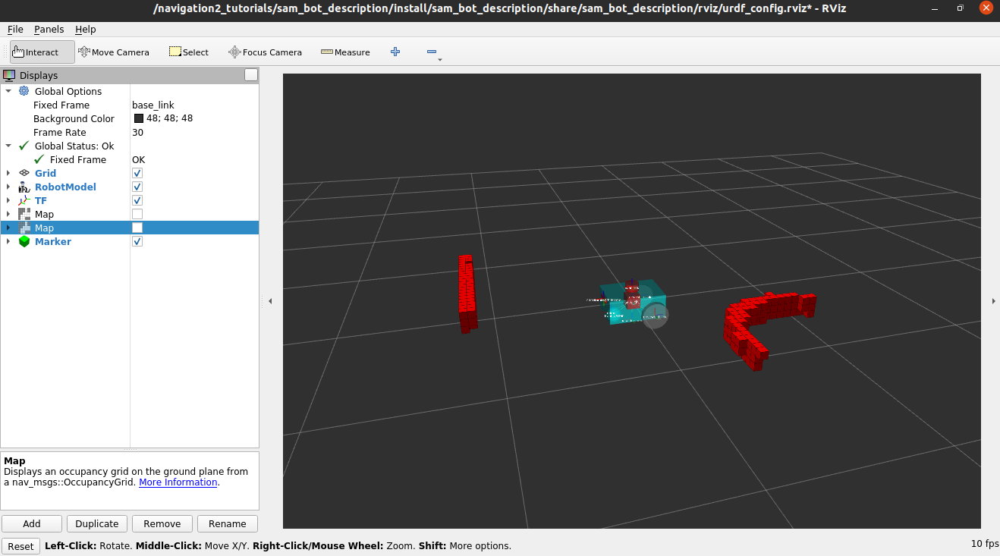

# Nav2 Tutorials Setting Up Sensors

## Context
Making ["Nav2/First-Time Robot Setup Guide/Setting Up Sensors"](https://navigation.ros.org/setup_guides/sensors/setup_sensors.html#mapping-and-localization) work

## Why
* For low compute, delays in startup makes processes start in the wrong order, resulting in malformed tf trees
* Resulting log messages direct towards solving different problems, but problems are only symptoms of this specific problem
* For beginners, prevent spending too much time guessing what the problem could be (I spent 5 days 😅)

## Symptom Errors
* Logs Timed out waiting for transform , frame does not exist
* RViz Global costmap No map received
* Message filter discarding message because queue is full

## Software
(specific versions documented in Dockerfile)
* ROS2 Galactic
* Nav2

## Usage
* Run line by line
* Automation untested, currently just documentation - i.e. Dockerfile and run.sh